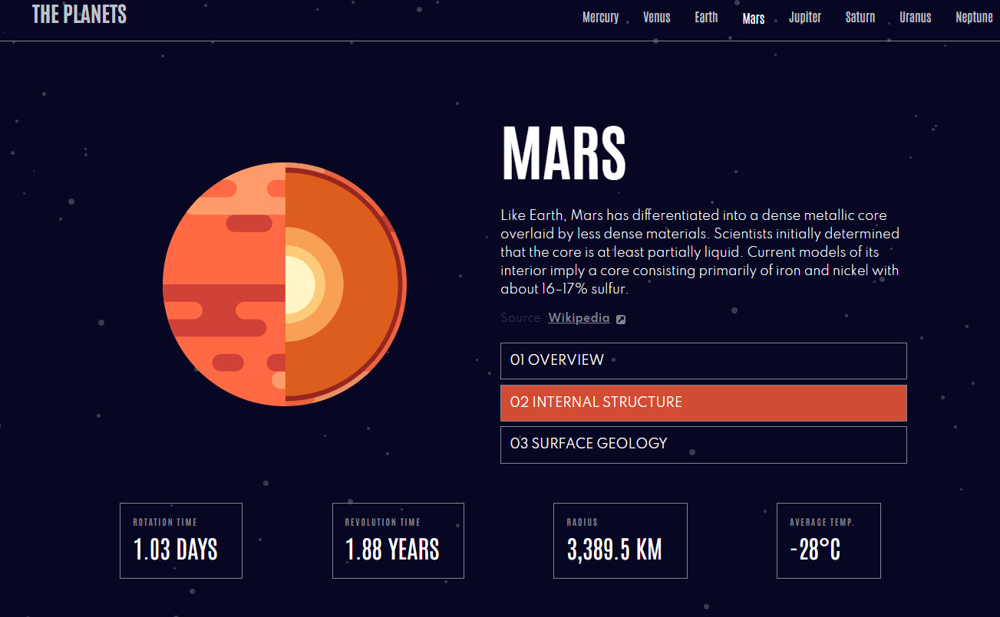

# Frontend Mentor - Planets fact site solution

This is a solution to the [Planets fact site challenge on Frontend Mentor](https://www.frontendmentor.io/challenges/planets-fact-site-gazqN8w_f). 

## Table of contents

- [Overview](#overview)
  - [The challenge](#the-challenge)
  - [Screenshot](#screenshot)
  - [Links](#links)
- [My process](#my-process)
  - [Built with](#built-with)
  - [What I learned](#what-i-learned)
  - [Continued development](#continued-development)
- [Author](#author)

## Overview

### The challenge

Users should be able to:

- View the optimal layout for the app depending on their device's screen size
- See hover states for all interactive elements on the page
- View each planet page and toggle between "Overview", "Internal Structure", and "Surface Geology"

### Screenshot

### Links

- Solution URL: [Add solution URL here](https://your-solution-url.com)
- Live Site URL: [Add live site URL here](https://your-live-site-url.com)

## My process

### Built with

- Semantic HTML5 
- CSS custom properties
- Flexbox
- CSS Grid
- Javascript
- Dynamic page
- NodeJS
- BDD
- EJS

### What I learned

This challenge helped me use BDD to improve my front-end results. It allowed me to focus on a single, simple page with dynamic data.

Using CSS Grid was very helpful for responsive design, providing a consistent layout across mobile, tablet, and desktop versions.

### Continued development

For this project, I plan to focus on adding transition animations, particularly based on user interactions.

## Author

- Linkedin - [Quentin Petton](www.linkedin.com/in/quentin-petton)
- Frontend Mentor - [@QuentinPetton](https://www.frontendmentor.io/profile/QuentinPetton)
